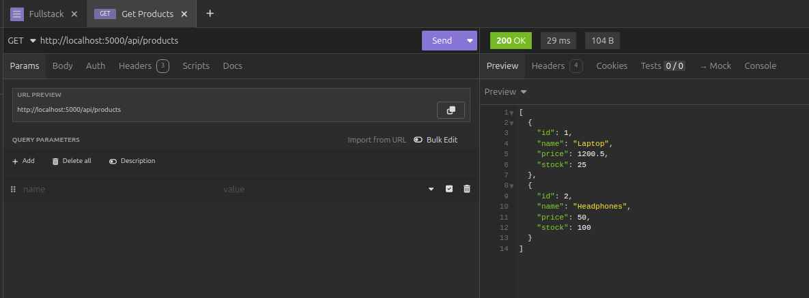
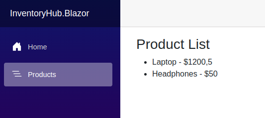

# InventoryHub

InventoryHub is a full-stack capstone project that demonstrates the integration of a Minimal API backend with a Blazor WebAssembly front-end. The project is designed to showcase how to build a robust full-stack application using .NET technologies with proper handling of cross-origin requests (CORS).

---

## Reflective Summary

### Overview

For the InventoryHub capstone project, I built a full-stack application using a Minimal API as the backend and a Blazor WebAssembly front-end. The application demonstrates seamless integration between these two layers: the backend returns JSON-compatible data structures, and the front-end fetches and displays that data. A key aspect of this project was handling cross-origin requests—common in full-stack development—by running the API and Blazor app on different ports and managing CORS appropriately.

### Project Setup

- **Backend (Minimal API):**
  - **Port:** The API runs on `http://localhost:5000`.
  - **Functionality:** It exposes an endpoint `/api/products` that returns product data (e.g., Laptop, Headphones) in JSON format.
  - **CORS Management:** The API is configured with a CORS policy to allow requests from different origins. This ensures that the front-end, running on a different port, can successfully make API calls without encountering cross-origin errors.

- **Front-end (Blazor WebAssembly):**
  - **Port:** The Blazor app runs on `http://localhost:5050`.
  - **Integration:** The Blazor component `FetchProducts.razor` calls the backend endpoint to retrieve and display product data.
  - **Configuration:** The `HttpClient` in the Blazor app is set with the backend's base address, ensuring proper communication with the API.

### How Copilot Assisted

- **Integration Code Generation:**  
  Copilot provided initial boilerplate code for both the Minimal API and the Blazor front-end. This included setting up top-level statements in the API and configuring dependency injection for `HttpClient` in Blazor.

- **Debugging & Troubleshooting:**  
  When encountering issues such as CORS errors or mismatched ports, Copilot offered code snippets and guidance on:
  - Configuring CORS in the API using `builder.Services.AddCors()` and `app.UseCors()`.
  - Setting the correct base address for `HttpClient` in the Blazor project.

- **Performance & Best Practices:**  
  Copilot suggested improvements like reducing redundant API calls on the front-end and implementing caching strategies on the back-end to optimize performance. This helped streamline data flow and enhance the overall efficiency of the application.

### Challenges and Solutions

- **Multiple Project Configuration:**  
  Running two separate projects (API and Blazor) on different ports is common in full-stack development. The backend runs on `http://localhost:5000`, and the front-end on `http://localhost:5050`. Copilot’s guidance made it easier to configure these settings and ensure smooth communication between the two.

- **CORS Management:**  
  Since the backend and front-end are served from different domains/ports, correctly configuring CORS was essential to prevent cross-origin errors. Copilot provided the necessary code to allow requests from the front-end's domain.

- **Data Structuring:**  
  The backend returns JSON-compatible data structures, which the front-end consumes without issues. Copilot’s code snippets for JSON deserialization (e.g., using `ReadFromJsonAsync<Product[]>()`) ensured that the data is correctly parsed and displayed.

### Lessons Learned

- **Full-Stack Integration:**  
  This project reinforced the importance of configuring separate environments for the front-end and back-end, a common practice in modern full-stack development.
  
- **Effective Use of Copilot:**  
  Copilot greatly accelerated development by generating initial code, offering debugging suggestions, and providing optimization tips. Reviewing and adapting its recommendations to the project's specific needs was crucial.

- **Performance Considerations:**  
  Optimizing API calls and implementing caching strategies can significantly improve application performance. Testing with browser developer tools and profiling confirmed these improvements without introducing regressions.

### Conclusion

Building InventoryHub provided valuable insights into full-stack development using .NET and Blazor. By running the backend on port 5000 and the front-end on port 5050, and by managing cross-origin requests through CORS, a robust integration was achieved where data flows seamlessly between the two layers. Copilot proved to be an invaluable tool throughout the process, enhancing efficiency and guiding best practices for both integration and performance optimization.

Below are two screenshots saved in the images folder:

